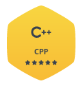
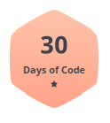

<h1 align="center">Hello , I'm Lokesh Sharma👋</h1>
<h3 align="center">2 ⭐ CodeChef || 5 ⭐ Hackerrank(Python,C,C++) || Competitive Coder || Web Development enthusiast</h3>

 

  

  

- 🔭 I’m currently **exploring different domains**

- 🌱 I’m currently learning **Data Structures and Algorithms and OOPS**

- 👯 I’m looking to collaborate **with anyone who wants to learn something new or could teach me something new.**

- 🤝 I’m looking for help with **Dynamic Programming**

- 📫 How to reach me **Insta @_veera2k_**

  

  

<h3 align="left">Connect with me:</h3>

**Technology Stack**

<code></code>
<code></code>
<code></code>
<code></code> 

<code></code>
<code></code>
<code></code>
<code></code>

<code></code>
<code></code>
<code></code>
<code></code>

  

